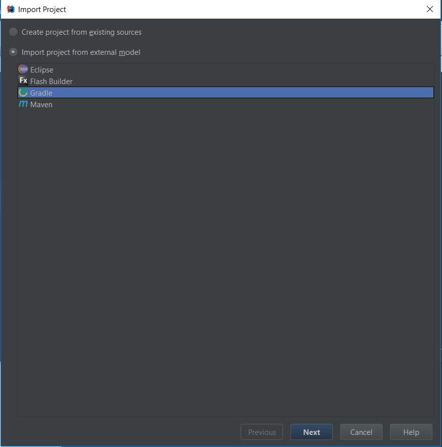
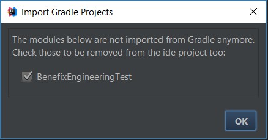
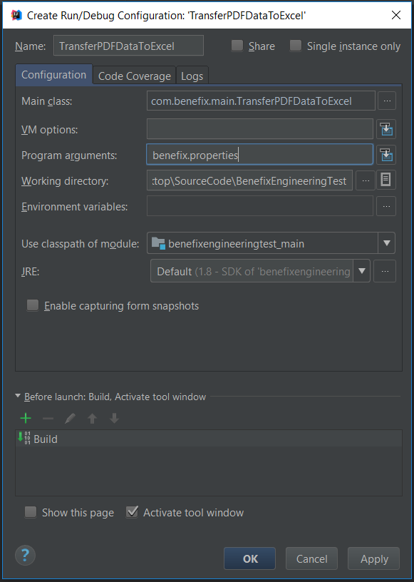

# PDFtoExcelParser

Simple application to parse PDF files and export the data to an excel spreadsheet
developed using Java and Gradle build tool.

<b>Third Party Libraries Used:</b>
1.	ITextPDF (https://mvnrepository.com/artifact/com.itextpdf/itextpdf/5.5.13): Used to parse PDF files and extract the data from it.
2.	Apache POI (https://mvnrepository.com/artifact/org.apache.poi/poi-ooxml/3.17): Used to read from and write to Excel (.xlsx) files 

<b>Running the application:</b>

Prerequisites: Java 8 should be installed

Clone the repo using the below command :

`git clone https://github.com/akshay-vedpathak/PDFtoExcelParser.git`

There are two ways to run the application
- Running the application directly using the executable JAR file from BenefixDemo directory
- Setting up the source code in an IDE and running the application   

<b>Steps to run the executable JAR file</b>

1. Open command prompt(Windows) or Terminal(MacOS/Linux) and navigate to the BenefixDemo directory
2. Run the following command to run the JAR file  
`java -jar benefixengineeringtest-all-1.0.jar benefix.properties`
3. Once you run the above command, you should see the following logs being generated

4. Post successful completion you can see the output file(BeneFix_Small_Group_Plans_upload_template) being generated in the directory BenefixDemo

<b>Steps to setup the source code in IDE and run the application</b>

_* I have mentioned the steps to setup the project in Intellij IDE_

1. Open Intellij and import the project BenefixEngineeringTest as a Gradle project, 
while importing the project make sure to check the below options

2. On the next screen check the following options

3. Post the import if you get the below alert dialog, please uncheck the BenefixEngineeringTest module

4. Open Project structue and make sure that below options are selected

5. Post that create the following “Run Configuration” (Please make sure to select the below mentioned values for the Run Configuration)

6. Run the above created run configuration and then you could see the logs of the application running
7. Once the process completes successfully the output file(BeneFix_Small_Group_Plans_upload_template)
 would be generated in BenefixEngineeringTest directory

